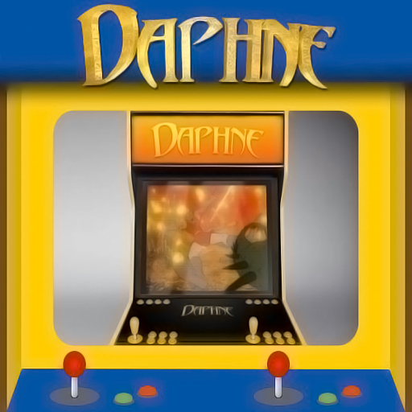
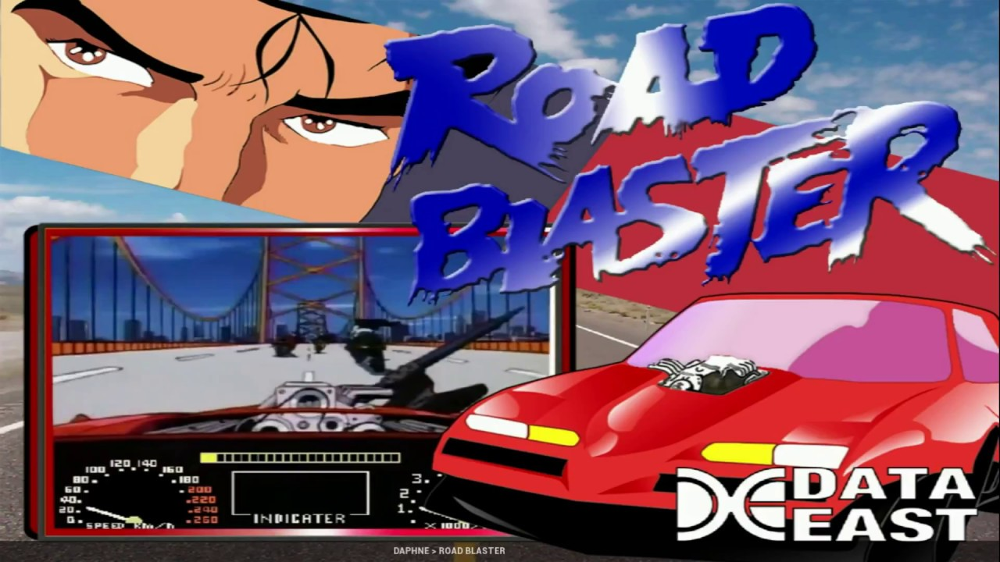
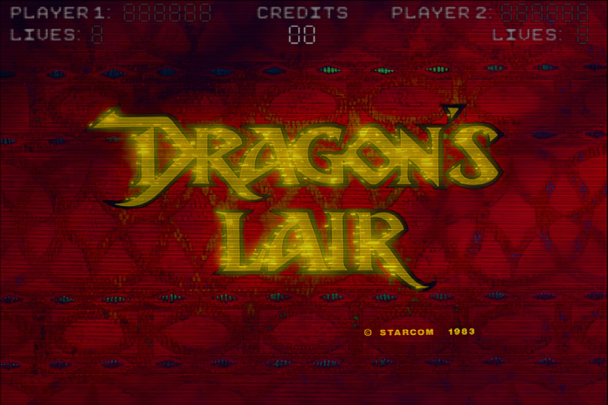

# Arcade (Daphne)

### Description

DAPHNE is a multi-arcade LaserDisc emulator that lets one play the original LaserDisc version on a PC.

### License

GPLv2+

### Icon

### Fanart

Help make me fanart!

### Screenshots

